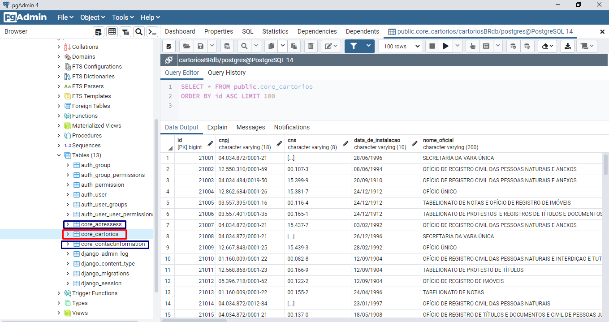

#### Instale o PostgreSQL e configure o settings.py . Tutorial abaixo:
(https://www.horadecodar.com.br/2019/01/24/integrando-django-com-postegresql-windows-e-linux/)

### Desafio

1. Registre os modelos **cartorios**, **adressess** e **contact_information** no Django Admin

2. Implemente os seguintes endpoints:

| Endpoint  |  Método  |  Ação  |
| ------------------- | ------------------- | ------------------- |
|  /cartorios |  GET |  Retorna lista de cartórios paginadas de 50 em 50 |
|  /cartorios/{uf} |  GET |  Retorna a lista de cartórios da UF paginadas de 50 em 50 |
|  /cartorios/{id} |  GET |  Retorna os detalhes de um cartório |
|  /cartorios |  POST |  Adiciona um novo cartório à base de dados |
|  /cartorios/{id} |  PUT |  Atualização completa de um cartório |
|  /cartorios/{id} |  PATCH |  Atualização Parcial de um cartório |
|  /cartorios/{id} |  DELETE |  Remove um cartório da base de dados |